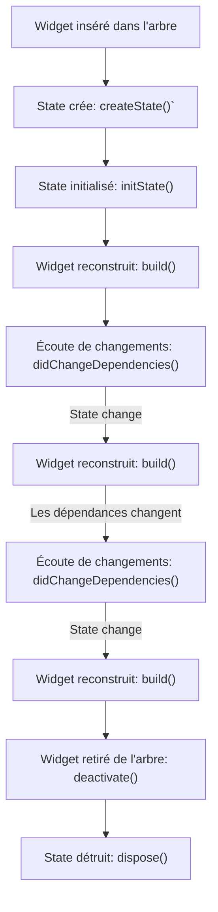
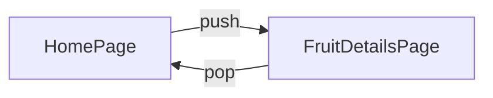

# Dossier 3: Stateful Widgets, Gestion des états, Animations explicites et Navigation

## Concepts clés

### Stateful Widgets

Un widget dans Flutter est soit étatique (Stateful) soit sans état (Stateless). Un `StatefulWidget` est un widget qui décrit une partie de l'interface utilisateur qui peut changer au fil du temps. Par exemple, si vous avez une case à cocher, elle peut être cochée ou décochée, donc elle est considérée comme un `StatefulWidget`.

```dart
class MonWidget extends StatefulWidget {
  @override
  _MonWidgetState createState() => _MonWidgetState();
}

class _MonWidgetState extends State<MonWidget> {
  //...
}
```
Dans ce code, `MonWidget` est une classe qui hérite de `StatefulWidget` et `_MonWidgetState` est une classe qui hérite de `State`.

Pour plus de détails, veuillez consulter la documentation officielle: [Stateful Widgets](https://api.flutter.dev/flutter/widgets/StatefulWidget-class.html)

### Gestion des États

La gestion de l'état fait référence à la manière dont vous stockez et manipulez les données qui peuvent changer avec le temps et qui peuvent affecter l'interface utilisateur de votre application.

```dart
class _MonWidgetState extends State<MonWidget> {
  bool _active = false;

  void _handleTap() {
    setState(() {
      _active = !_active;
    });
  }

  //...
}
```
Ici, `_active` est une variable d'état. Lorsque l'utilisateur appuie sur un bouton, `_handleTap` est appelée, ce qui appelle `setState` et inverse la valeur de `_active`. Ensuite, Flutter reconstruit l'interface utilisateur pour refléter le nouvel état.

Pour plus de détails, veuillez consulter la documentation officielle: [State Management](https://flutter.dev/docs/development/data-and-backend/state-mgmt)

### Animations Explicites

Flutter vous permet de contrôler chaque frame de votre animation et de créer des animations complexes en combinant plusieurs animations. Ces animations sont appelées animations explicites.

```dart
AnimationController controller;
Animation<double> animation;

@override
void initState() {
  super.initState();

  controller = AnimationController(
      duration: const Duration(seconds: 2), vsync: this);
  animation = CurvedAnimation(parent: controller, curve: Curves.easeIn);

  controller.forward();
}

//...

@override
Widget build(BuildContext context) {
  return AnimatedBuilder(
    animation: animation,
    builder: (BuildContext context, Widget child) {
      return Transform.scale(scale: animation.value, child: child);
    },
    child: FlutterLogo(size: 200.0),
  );
}
```
Dans cet exemple, un `AnimationController` contrôle la durée de l'animation. Le `CurvedAnimation` modifie la progression de l'animation pour implémenter une courbe d'animation. Le `AnimatedBuilder` renvoie un widget qui change de taille en fonction de la valeur actuelle de l'animation.

Pour plus de détails, veuillez consulter la documentation officielle: [Explicit Animations](https://flutter.dev/docs/development/ui/animations/tutorial)

### Navigation

La navigation fait référence à la manière dont vous structurez les différentes pages de votre application et comment vous passez d'une page à l'autre. Flutter utilise une structure de type "stack" pour gérer les différentes pages de votre application.

```dart
Navigator.push(context, MaterialPageRoute(builder: (context) => DeuxiemePage()));
```
Cet exemple illustre comment naviguer vers une nouvelle page. Le `MaterialPageRoute` est un widget qui crée une transition de page appropriée pour la plateforme.

Pour plus de détails, veuillez consulter la documentation officielle: [Navigation](https://flutter.dev/docs/cookbook/navigation/navigation-basics)

## Tutoriel

Pour ce tutoriel, nous allons construire une application qui comprend un widget étatique, des changements d'état, des animations explicites et de la navigation. Le résultat final sera une application de vote où les utilisateurs peuvent voter pour leurs fruits préférés et voir les résultats des votes en temps réel.

**Étape 1: Configuration initiale**

Commencez par créer un nouveau projet Flutter en utilisant la commande suivante dans votre terminal :

```bash
flutter create mon_application_de_vote
```

Cela créera un nouveau projet Flutter avec un code d'exemple. Vous pouvez supprimer ce code d'exemple, car nous allons écrire notre propre application.

**Étape 2: Création de notre StatefulWidget**

Ensuite, nous allons créer notre widget `VoteApp`. Ceci est un widget étatique qui sera l'écran principal de notre application. Ajoutez le code suivant à votre fichier `main.dart` :

```dart
class VoteApp extends StatefulWidget {
  @override
  _VoteAppState createState() => _VoteAppState();
}
```

Dans ce code, nous avons créé une nouvelle classe `VoteApp` qui hérite de `StatefulWidget`. Ensuite, nous avons remplacé la méthode `createState` pour renvoyer une nouvelle instance de `_VoteAppState`. Cette classe `_VoteAppState` est l'état de notre widget et contiendra toutes nos variables d'état.

**Étape 3: Ajout d'état à notre widget**

Ensuite, nous allons ajouter un état à notre widget. Dans ce cas, l'état sera une liste de fruits et le nombre de votes pour chaque fruit. Ajoutez le code suivant à votre classe `_VoteAppState` :

```dart
class _VoteAppState extends State<Vote

App> {
  Map<String, int> votes = {
    'Pommes': 0,
    'Oranges': 0,
    'Bananes': 0,
  };

  // ...
}
```

Ici, nous avons créé une nouvelle variable `votes` qui est un `Map` de `String` à `int`. Chaque clé dans cette map est le nom d'un fruit et chaque valeur est le nombre de votes pour ce fruit.

**Étape 4: Création de l'interface utilisateur de notre widget**

Maintenant, nous allons créer l'interface utilisateur de notre widget. Ajoutez le code suivant à votre méthode `build` dans la classe `_VoteAppState` :

```dart
@override
Widget build(BuildContext context) {
  return Scaffold(
    appBar: AppBar(
      title: Text('Vote pour ton fruit préféré!'),
    ),
    body: ListView(
      children: votes.keys.map((fruit) {
        return ListTile(
          title: Text(fruit),
          trailing: Text(votes[fruit].toString()),
          onTap: () {
            setState(() {
              votes[fruit]++;
            });
          },
        );
      }).toList(),
    ),
  );
}
```

Dans ce code, nous avons utilisé le widget `Scaffold` pour créer l'interface utilisateur de base de notre application. Ensuite, nous avons créé une `ListView` qui contient une `ListTile` pour chaque fruit dans notre map `votes`. Chaque `ListTile` affiche le nom du fruit et le nombre de votes pour ce fruit. Lorsque l'utilisateur appuie sur une `ListTile`, nous appelons `setState` pour augmenter le nombre de votes pour ce fruit.

**Étape 5: Ajout d'une animation explicite**

Pour rendre notre application plus réactive, nous allons utiliser le widget `AnimatedSwitcher` pour animer le changement de nombre de votes pour chaque fruit.

Modifiez le code de la `ListTile` dans la méthode `build` comme suit :

```dart
return ListTile(
  title: Text(fruit),
  trailing: AnimatedSwitcher(
    duration: const Duration(milliseconds: 500),
    transitionBuilder: (Widget child, Animation<double> animation) {
      return FadeTransition(child: child, opacity: animation);
    },
    child: Text(
      votes[fruit].toString(),
      key: ValueKey<int>(votes[fruit]),
    ),
  ),
  onTap: () {
    setState(() {
      votes[fruit]++;
    });
  },
);
```

Ici, `AnimatedSwitcher` anime le changement de son widget enfant. Chaque fois que nous appelons `setState` et que le nombre de votes change, `AnimatedSwitcher` effectue une animation de transition du widget enfant actuel vers le nouveau widget enfant. Dans ce cas, il effectue une transition en fondu de l'ancien nombre de votes vers le nouveau nombre.

**Étape 6: Gestion du state de notre widget**

L'étape précédente nous a permis de gérer l'état de chaque fruit de manière indépendante. Pour mieux comprendre, faisons une parenthèse pour expliquer le cycle de vie d'un stateful widget :



Notez que dans ce cycle de vie, initState() est appelé une fois pour initialiser le State, et build() est appelé chaque fois que l'état du widget change. didChangeDependencies() est appelé juste après initState() et chaque fois que les dépendances du widget changent.

**Étape 7: Ajout de la navigation à notre widget**

Maintenant, nous allons ajouter une fonctionnalité qui permet à l'utilisateur d'accéder à une nouvelle page contenant plus de détails sur chaque fruit lorsqu'il appuie sur la `ListTile`. Pour cela, nous utiliserons le widget `Navigator`.

```dart
onTap: () {
  Navigator.push(
    context,
    MaterialPageRoute(
      builder: (context) => FruitDetailsPage(fruit: fruit),
    ),
  );
}
```

Ici, `Navigator.push` ajoute une `FruitDetailsPage` à la pile de navigation. Cela signifie que Flutter affiche `FruitDetailsPage` et que l'utilisateur peut revenir à la page précédente en appuyant sur le bouton de retour.

Voici comment la pile de navigation pourrait être visualisée :



**Étape 8: Création de notre page de détails**

La page de détails du fruit est une autre `StatefulWidget` qui affiche des informations sur un fruit donné.

```dart
class FruitDetailsPage extends StatefulWidget {
  final String fruit;

  FruitDetailsPage({@required this.fruit});

  @override
  _FruitDetailsPageState createState() => _FruitDetailsPageState();
}

class _FruitDetailsPageState extends State<FruitDetailsPage> {
  //...
}
```

**Étape 9: Ajout de la navigation à notre page de détails**

Sur cette page, nous afficherons simplement le nom du fruit et un bouton pour revenir à la page précédente.

```dart
@override
Widget build(BuildContext context) {
  return Scaffold(
    appBar: AppBar(
      title: Text(widget.fruit),
    ),
    body: Center(
      child: RaisedButton(
        child: Text('Retour'),
        onPressed: () {
          Navigator.pop(context);
        },
      ),
    ),
  );
}
```

Le bouton "Retour" utilise `Navigator.pop` pour supprimer `FruitDetailsPage` de la pile de navigation, ce qui ramène l'utilisateur à la `HomePage`.

**Étape 10: Amélioration de la navigation**

Flutter fournit une navigation de base avec `Navigator.push` et `Navigator.pop`, mais pour les applications plus complexes, vous voudrez peut-être utiliser une bibliothèque de routage comme `go_router`.

Avec `go_router`, vous pouvez définir toutes vos routes dans un seul endroit et naviguer entre elles en utilisant les noms de routes. Cela rend la navigation plus déclarative et plus facile à gérer.

```dart
// Au lieu de cela
Navigator.push(context, MaterialPageRoute(builder: (context) => DeuxiemePage()));

// Vous pouvez faire ceci
context.go('/deuxiemePage');
```

Enfin, lancez votre application en utilisant la commande `flutter run` dans votre terminal. Vous devriez maintenant pouvoir voter pour vos fruits préférés, voir le nombre de votes changer avec une belle animation et naviguer vers une page de détails pour chaque fruit.

## Conclusion

Félicitations, vous avez créé une application de vote avec Flutter ! Vous avez appris à créer des widgets étatiques, à gérer l'état de votre application, à ajouter des animations à vos widgets et à naviguer entre les pages de votre application. Si vous avez un doute ou que quelque chose ne va pas, la correction est disponible dans la fichier [`correction.md`](./correction.md)

Dans le prochain dossier, nous allons explorer plus en détail les concepts de widgets hérités, de rendu et d'accessibilité. Restez à l'écoute pour en savoir plus !